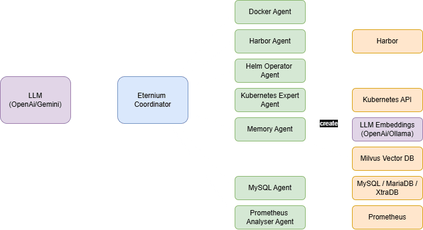

# Eternium - A Homelab Operations Agency

This repository contains the source code for the **Eternium Agency**: a modular, multi-agent system designed to automate, monitor, and manage your homelab infrastructure through natural language commands.

## Overview

The Eternium Agency is an AI-powered crew of specialist agents orchestrated by a central coordinator. Instead of writing complex scripts or navigating multiple dashboards, you can simply ask the agency to perform tasks. It understands your intent and delegates the work to the right specialist, whether it's checking your Kubernetes cluster, managing your container registry, or querying performance metrics.

The system is built using Python and the Google Agent Development Kit (ADK), and it is designed to be highly modular and configurable.

### Architecture

The agency operates on a hierarchical model. A central `Coordinator` agent acts as a manager, interpreting user requests and delegating them to the appropriate specialist sub-agent.



### Features

  - **Modular Agent Architecture**: Easily enable or disable agents for different services via configuration.
  - **Natural Language Interface**: Interact with your entire homelab through a simple chat interface.
  - **Multi-Step Reasoning**: Capable of complex, multi-step, multi-agent workflows to answer questions or perform tasks.
  - **Persistent Memory**: The Memory Agent uses a Milvus vector database to learn and recall information across restarts.
  - **Service Integrations**: Out-of-the-box support for Kubernetes, Docker, Helm, Prometheus, Harbor, MySQL, and more.
  - **Containerised & Deployable**: Comes with a `Dockerfile` and a Helm chart for easy deployment into any Kubernetes cluster.

### The Agency Team

The Eternium agency is composed of a Coordinator and a team of specialist sub-agents, each with a distinct role and set of capabilities.

| Agent Name | Description | Key Responsibilities & Tools |
| :--- | :--- | :--- |
| **`eternium_coordinator`** | The **Manager & Dispatcher**. It interprets all user requests and delegates tasks to the appropriate specialist | - Natural Language Understanding<br />- Intent classification<br />- Task delegation to sub-agents<br />- Final response synthesis |
| **`kubernetes_expert`** | The **Infrastructure Engineer**. It interacts directly with the Kubernetes API to manage and diagnose cluster resources | - List/describe pods, deployments, etc.<br />- Get container logs<br />- Scale deployments<br />- Patch image versions |
| **`helm_operator`** | The **Application Lifecycle Manager**. It manages applications deployed via Helm charts | - List installed applications (releases)<br />- Get release status and history<br />- Upgrade applications to new versions |
| **`docker_agent`** | The **Image Logistics Operator**. It manipulates local container images on the host machine | - `docker pull` from public registries<br />- `docker tag` images for the local registry<br />- `docker push` images to the local registry |
| **`registry_inspector`** | The **Quality Assurance & Security Officer**. It reads data from the Harbor container registry | - List projects and repositories<br />- List image tags (versions)<br />- Get vulnerability reports<br />- Trigger new image scans |
| **`prometheus_analyser`** | The **Monitoring Analyst**. It translates natural language questions into precise PromQL queries | - Formulate and execute PromQL queries<br />- Retrieve metrics for CPU, memory, etc.<br />- Check the status of monitored services |
| **`mysql_dba`** | The **Database Administrator**. It performs administrative tasks on a MySQL server | - Create/drop databases and users<br />- Grant/revoke permissions<br />- Execute raw SQL queries<br />- Perform database backups |
| **`memory_agent`** | The **Librarian & Archivist**. It manages the agency's persistent, long-term memory | - Store new facts (`add_to_memory`)<br />- Retrieve relevant context (`query_memory`)<br />- Find/delete old memories |

## Prerequisites

Before running the agency, ensure the following services are running and accessible:

- A Kubernetes cluster
- A container runtime on your local machine (Docker) for image manipulation tools.
- A Harbor container registry.
- A Prometheus instance for metrics.
- A Milvus vector database for memory.
- An LLM provider (e.g., a local Ollama server or an OpenAI API key).

## Configuration

All configuration is managed through a single `.env` file in the project root.

1.  Copy the example file: `cp .env.example .env`
2.  Edit the `.env` file with the URLs and credentials for your specific services.

## Getting Started

### 1. Install Dependencies

It is recommended to use a Python virtual environment.

```bash
python -m venv .venv
source .venv/bin/activate
pip install -r requirements.txt
```

### 2. Run Locally for Development

This command starts the Uvicorn web server.

```bash
python main.py
```

You can now access the ADK Web UI at **`http://localhost:8000/dev-ui/?app=eternium`**

### 3. Build & Run with Docker

```bash
# Build the container image
docker build -t eternium-agent .

# Run the container, passing in your .env file for configuration
docker run --rm -it --env-file .env -p 8000:8000 eternium-agent
```

## Helm Deployment

The most robust way to deploy the agency is with the provided Helm chart located in the `/charts/eternium-agent` directory.

1.  **Customise Values:** Create a `my-values.yaml` file and override any default settings from the chart's `values.yaml`, especially the `config` and `secrets` sections.
2.  **Install the Chart:**
    ```bash
    helm install eternium ./charts/eternium-agent --namespace my-agents --create-namespace -f my-values.yaml
    ```

## Interacting with the Agent

Once the agent is running, you can interact with it via the ADK Web UI. Here are some example queries you can try:

  * **Simple Query:** `List all the namespaces in my cluster.`
  * **Memory Query:** `Please remember that the on-call engineer for the database team is 'Alice'.`
  * **Follow-up Memory Query:** `Who is the on-call for the database team?`
  * **Multi-Step Diagnostic:** `My 'prowlarr' pod in the 'media' namespace is crashing. Can you find out why?`
  * **Multi-Agent, Cross-Domain Query:** `What version of 'nginx' is running in the 'ingress' namespace, and does that image have any critical vulnerabilities in Harbor?`

## Security

  - Store all sensitive credentials in your `.env` file locally or as Kubernetes Secrets when deploying via Helm. **Never commit your `.env` file to Git.**
  - The application runs as a non-root user (`appuser`) inside the container for enhanced security.

## Contributing

Feel free to open issues or submit pull requests for new agents or improvements!

## Future Agents

I'll be looking to extend this in the future with potentially (but not limited to)...

- **Alertmanager Agent** – View, group, and acknowledge active alerts from Prometheus Alertmanager
- **Loki Agent** – Search logs, summarise errors, correlate with services
- **Terraform Agent** – Inspect infrastructure state, run `plan` or `validate` via APIs
- **Ansible Agent** – Trigger playbooks, inspect inventories or host variables
- **Falco Agent** – Display runtime security alerts and suspicious behaviour
- **Trivy Agent** – Report on container CVEs, Git repo scans, and SBOMs
- **Self-Healing Agent** – Detect problems and propose (or trigger) remediations
- **Knowledge Agent** – Provide RAG-based Q&A from internal docs and wikis
- **Self-Healing Agent** – Detect problems and propose (or trigger) remediations
- **Planner Agent** – Multi-step LLM planner for coordinated DevOps actions
- etc...

Possibilities are endless...

## License and Usage

This project is licensed under the MIT License with a Non-Commercial Addendum.

- **Personal, educational, and homelab use:** Free and unrestricted, in accordance with the MIT License.
- **Commercial use:** Not permitted without explicit, written permission from the copyright holder.

If you wish to use this project or its code in a commercial setting, please contact [GizzmoShifu](https://github.com/GizzmoShifu) to discuss licensing terms.

Please see the [LICENSE](./LICENSE) file for full details.
